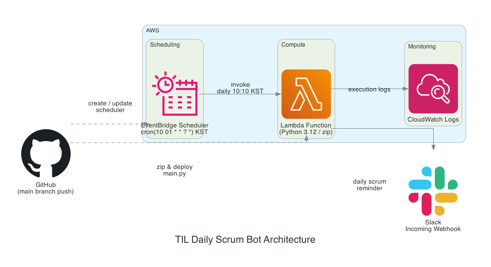

# TIL
k8RVIS 팀의 데일리 스크럼 봇

## 아키텍처



| 구성 요소 | 역할 |
| --- | --- |
| **EventBridge Scheduler** | 매일 오전 10시 01분 KST에 Lambda를 호출 |
| **Lambda** (Python 3.12 / zip) | Slack Webhook으로 데일리 스크럼 메시지 전송 |
| **CloudWatch Logs** | Lambda 실행 로그 수집 |
| **GitHub Actions** | CI/CD — `main.py` zip 패키징, Lambda·Scheduler 배포 |
| **Slack** | 데일리 스크럼 알림 메시지 수신 |

## 설정 방법

### 1. Slack Incoming Webhook URL 발급

1. Slack API 사이트 → Create New App → From scratch
2. Incoming Webhooks 활성화 → Add New Webhook to Workspace
3. 알림 받을 채널 선택 → Webhook URL 복사

### 2. GitHub Secret 등록
GitHub 레포지토리 → Settings → Secrets and variables → Actions → New repository secret

### 3. 슬랙에 전송되는 메시지 양식
```
데일리 스크럼 양식

이름:

어제 한 일:
-

오늘 할 일:
-

블로커 / 이슈:
-

공유 사항:
-
```